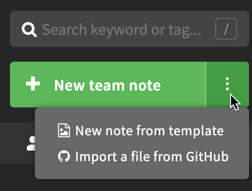
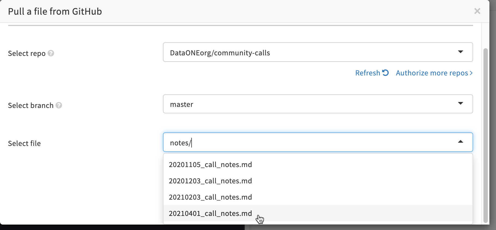
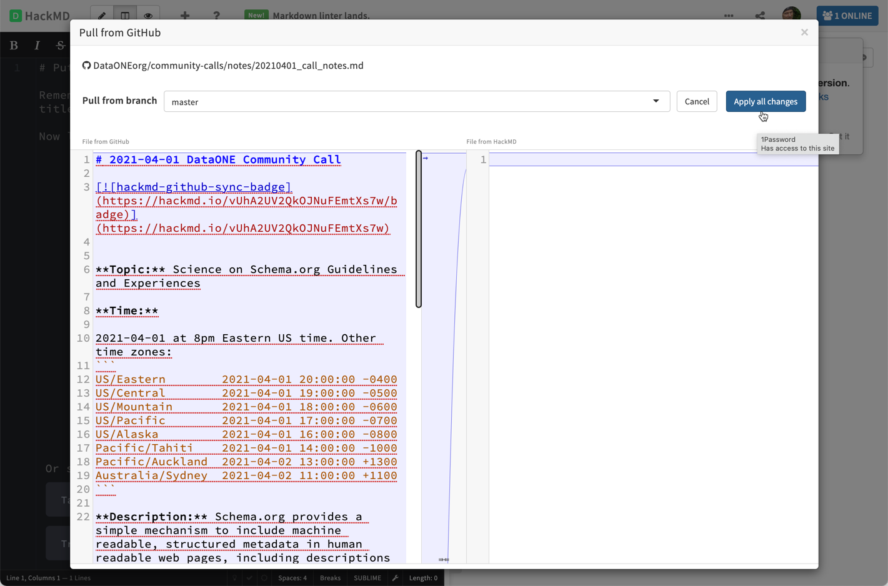
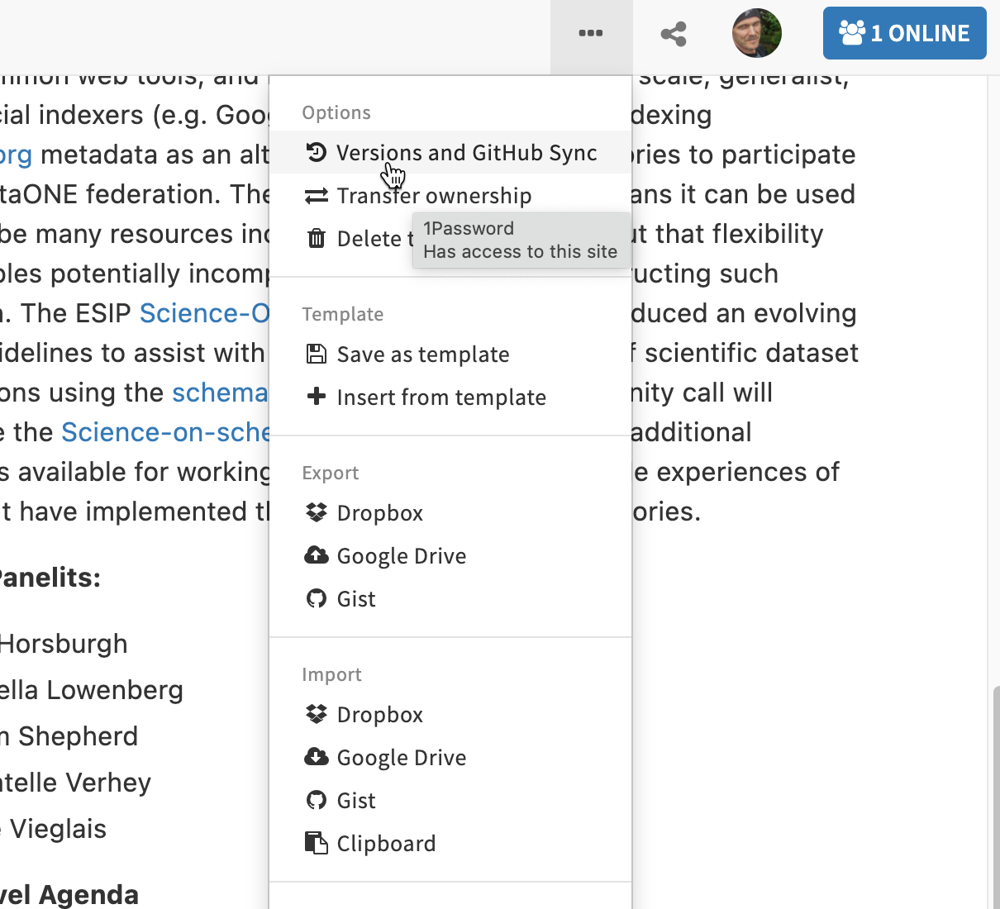
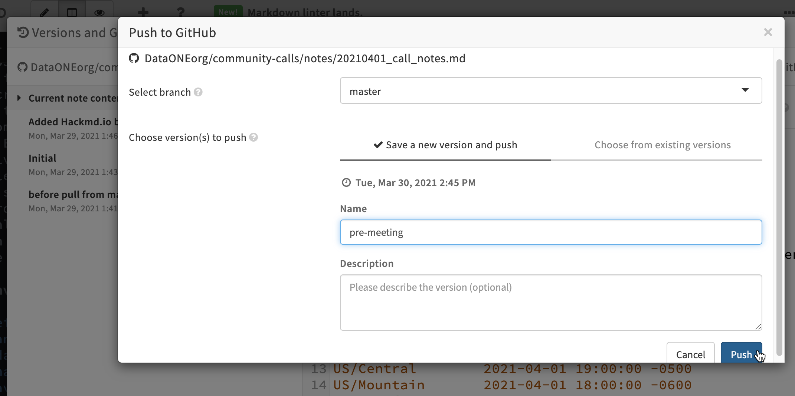

# Creating DataONE Community Call Notes

## Initial import from GitHub to HackMD
1. Create a new note in the `/notes` folder using a naming convention like: `yyyymmdd_call_notes.md`. Add some initial content to the document (can be edited later).
2. Visit hackmd.io and login using GitHub credentials.
3. Select “Import a file from Github” under “New team note”

4. Select the `DataONEorg/community-calls` repository, `master` branch, and the file from the `notes/` folder created in step 1. Then click “Pull” to load that document into HackMD.

5. The next screen is the pull request, which shows the source on the left, and the destination on the right which is empty since it’s a new document. Click on “Apply all changes” to import the document.

 
## Pushing a revision from HackMD to GitHub
After editing, a version can be pushed back to GitHub where it is preserved in the git repo.

1. Click on the ellipsis at the top right, and select “Versions and GitHub Sync”

2. In the Versions and GitHub Sync dialog, select “Push”, then “Save a new version and push” in the popup. Give the version a name (like a git commit message) and click “Push” to send the note to GitHub.

